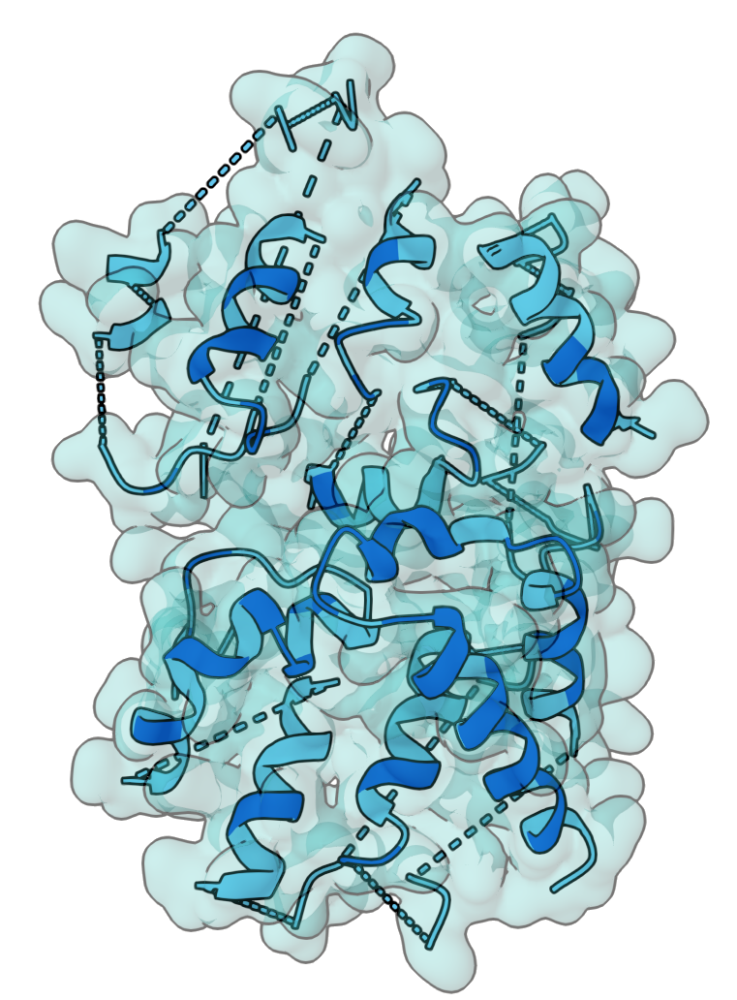
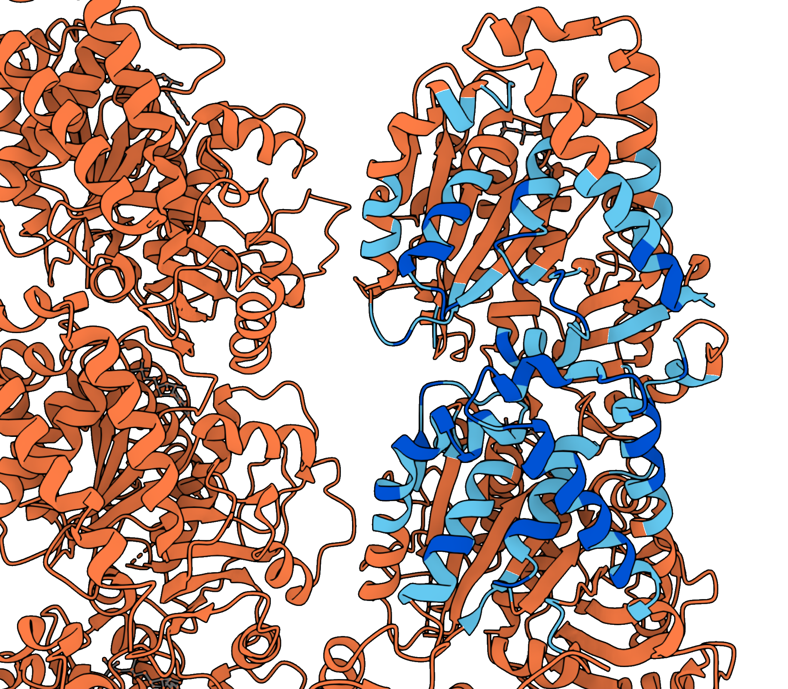

# Hotspot Selector

Trims protein structures to **surface hotspot regions**: exposed surface residues and the backbone-supporting residues around them.

<p align="center">
  
</p>

<p align="center">
  <em>Surface patch around an anchor residue. Exposed residues (blue), Supporting residues (cyan), and buried core (orange).</em>
</p>

<p align="center">
  
</p>

<p align="center">
  <em>Annotated PDB structure colored by residue class (β-factor). Blue = Exposed (design targets), Cyan = Supporting (backbone), Orange = Other (buried core).</em>
</p>

## Residue classes

Hotspot Selector classifies all residues into three categories based on solvent accessibility and spatial proximity:

| Class | Description | β-factor | Molecular Role |
|-------|-------------|----------|-----------------|
| **Exposed** | Relative SASA ≥ threshold (default 0.10) — definitively on the solvent-accessible surface | **91** | Directly accessible to solvent; primary targets for design or binding |
| **Supporting** | Any atom within 4 Å of an Exposed residue — backbone context for the hotspot | **81** | Provide structural context and support interactions; included to preserve backbone geometry |
| **Other** | Buried interior residues without Exposed neighbors | **49** | Buried protein core; typically unchanged in design workflows |

**SASA Background:** Relative SASA (Solvent-Accessible Surface Area) is computed using the **ShrakeRupley algorithm** against empirical maximum values per residue type (Tien et al. 2013). A residue with SASA ≥ 10% of its theoretical maximum is considered Exposed.

## Outputs

| File | Contents |
|------|----------|
| `<stem>_annotated.pdb` | Full structure; β-factor encodes class for visualisation |
| `<stem>_hotspot.pdb` | Exposed + Supporting residues only — pipeline-ready hotspot |
| `<stem>_hotspot_residue_index.txt` | Compact hotspot residue index string (for example `A96-116,A144-155,B1-7`). Can be used directly in RFdiffusion as contig.|

## Installation

**Requirements:**
- Python 3.8+
- Conda or Mamba (for environment management)

**Setup (first time only):**

```bash
# Clone and navigate to the repository
cd hotspot_selector

# Create conda environment with dependencies
conda env create -f environment.yml
conda activate hotspot
```

**Verify installation:**

```bash
python hotspot_selector.py --help
```

## Usage

Hotspot Selector uses **anchor mode**: you specify one or more anchor residues on the surface, and the tool selects a local surface patch around them using Dijkstra's algorithm on the surface graph.

### Basic example

```bash
# Single anchor on chain A, residue 42
python hotspot_selector.py structure.pdb --anchor A:42

# Multiple anchors
python hotspot_selector.py structure.pdb --anchor A:42 A:43 B:10

# Specify output directory
python hotspot_selector.py structure.pdb --anchor A:42 --output-dir ./results
```

### Tuning the selection (optional)

Control surface coverage and residue classification:

```bash
# Increase surface radius to select larger patches (default 25 Å)
python hotspot_selector.py structure.pdb --anchor A:42 --surface-radius 40.0

# Stricter Exposed threshold (10% → 20% SASA; smaller patches)
python hotspot_selector.py structure.pdb --anchor A:42 --sasa-threshold 0.20

# Cap the total hotspot size (Exposed + Supporting)
python hotspot_selector.py structure.pdb --anchor A:42 --max_residues 150

# Extend Supporting shell (4 Å → 6 Å; more structural context)
python hotspot_selector.py structure.pdb --anchor A:42 --support-dist 6.0
```

### Example walkthrough (2XRP from PDB)

```bash
# Create directories (first time only)
mkdir -p examples outputs

# Download a test structure from RCSB PDB
curl -fsSL https://files.rcsb.org/download/2XRP.pdb -o examples/2XRP.pdb

# Run hotspot selection around anchor B:409
python hotspot_selector.py examples/2XRP.pdb --anchor B:409 --output-dir ./outputs

# Inspect outputs
ls -lh ./outputs/2XRP_*
cat ./outputs/2XRP_hotspot_residue_index.txt
```

**Expected output:**
```
Exposed residues: 64
Supporting residues: 147
Output files:
  - 2XRP_annotated.pdb (2.2M) — full structure with β-factors
  - 2XRP_hotspot.pdb (128K) — hotspot only
  - 2XRP_hotspot_residue_index.txt → A2-3,A102-104,...,B389-431
```

### Options

| Flag | Default | Description |
|------|---------|-------------|
| `--sasa-threshold` | `0.1` | Relative SASA cutoff for Exposed classification (0–1) |
| `--support-dist` | `4.0` | Distance (Å) used to identify Supporting residues |
| `--output-dir` | same dir as input | Where to write output files |
| `--anchor` | *(required)* | One or more anchor residues: `CHAIN:RESNUM` (e.g., `--anchor A:42 B:10`) |
| `--surface-radius` | `25.0` | Max surface-path distance (Å) from anchor(s) |
| `--max_residues` | `None` | Cap hotspot size (Exposed+Supporting); if exceeded, `--surface-radius` is reduced automatically until the cap is met |
| `--graph-step` | `20.0` | Max Cα–Cα for a graph edge; increase to hop across larger solvent gaps |
| `--probe-radius` | `2.5` | Min clearance (Å) from any buried protein atom; edges cutting through buried core are rejected |

### Surface-walk algorithm

Why Dijkstra on a surface graph? Euclidean distance selects residues through the protein interior, which is not useful for design. The tool instead builds a surface-only graph to find true surface-path distance:

**Algorithm:**
1. **Build surface graph**: Nodes = all Exposed residues. Edges connect residues whose Cα atoms are within `--graph-step` Å (default 20 Å).
2. **Validate edges**: For each candidate edge, sample the Cα–Cα segment every ~1 Å and check against a KD-tree of buried (Other) atom positions. If any sample point is within `--probe-radius` Å of a buried atom, **reject the edge** (it cuts through the protein core).
3. **Run Dijkstra**: Find shortest *surface-path* distance from anchor residue(s) to all other Exposed residues.
4. **Select residues**: Keep all Exposed residues within `--surface-radius` Å of surface-path distance, plus their Supporting neighbors.
5. **Enforce size cap** (optional): If `--max_residues` is set, automatically reduce `--surface-radius` until the selection fits.

## Visualisation

Open `<stem>_annotated.pdb` in **[NanoViewer](https://nanoviewer.xyz)** or **[Mol*](https://molstar.org/viewer/)** and colour by **pLDDT / B-factor** to see the classification:

### Color mapping table

| β-factor | Class | Color | Hex Code | Meaning |
|----------|-------|-------|----------|---------|
| **91** | **Exposed** | <span style="color: #0066ff">■</span> Blue | `#0066ff` | Directly accessible to solvent; primary design targets |
| **81** | **Supporting** | <span style="color: #10cff1">■</span> Cyan | `#10cff1` | Backbone context; structural support for hotspot |
| **49** | **Other** | <span style="color: #ff8c00">■</span> Orange | `#ff8c00` | Buried protein interior; typically preserved |

**Visualization tips:**
- The annotated structure shows the full protein with residue classes encoded as β-factors
- Use the color scale to quickly identify which residues will be retained in the hotspot
- The hotspot output (`*_hotspot.pdb`) contains only Exposed + Supporting residues

## How it works

The pipeline:

1. **Load structure** — Uses BioPython to load PDB or CIF format, auto-detecting the file type.

2. **Compute SASA** — Runs the **ShrakeRupley solvent-accessible surface area (SASA)** algorithm (BioPython built-in).
   - No external dependencies required
   - Computes atomic SASA, then aggregates to per-residue values
   - Fast (~1–2 seconds for typical structures)

3. **Classify residues** — Computes **relative SASA** per residue by dividing by empirical maximum values (Tien et al. 2013):
   - Residues with relative SASA ≥ `--sasa-threshold` (default 0.10) → **Exposed**
   - All other residues → queued for Supporting check

4. **Find Supporting residues** — For each Exposed residue, queries all atoms within `--support-dist` Å (default 4 Å):
   - Any residue with an atom in this radius → **Supporting**
   - Provides structural context and backbone geometry

5. **Validate anchor residues** — Check that specified anchor residues exist and are Exposed on the surface. If an anchor is Buried, the tool warns but proceeds (useful for interface analysis).

6. **Build surface graph** — Create a graph where:
   - Nodes = all Exposed residues
   - Edges connect residues whose Cα atoms are within `--graph-step` Å (default 20 Å)
   - Each edge is validated: sample the Cα–Cα segment every ~1 Å and check against a KD-tree of buried (Other) atoms. Reject edges that cut through the protein core.

7. **Run Dijkstra** — Find shortest *surface-path* distance from anchor residue(s) to all other Exposed residues.

8. **Select by radius** — Keep all Exposed residues within `--surface-radius` Å (default 25 Å) of surface-path distance, plus their Supporting neighbors.

9. **Enforce size cap** (optional) — If `--max_residues` is set, automatically reduce `--surface-radius` until the selection fits the cap.

10. **Write outputs** — Generates three output files:
    - `*_annotated.pdb` — Full structure with β-factors encoding residue class (91/81/49)
    - `*_hotspot.pdb` — Hotspot only (Exposed + Supporting residues in the selected patch)
    - `*_hotspot_residue_index.txt` — Compact residue range string (e.g., `A2-4,A53-55,...,B406-412`)
